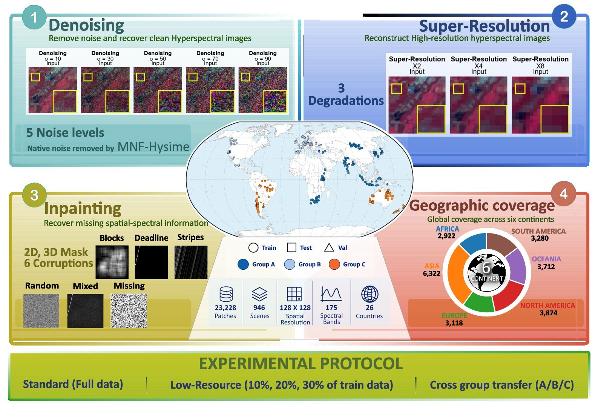

# HSRest Dataset Card



## 1. Overview

HSRest is a hyperspectral image restoration benchmark constructed from real-world
EO-1 Hyperion imagery. The benchmark provides data and reproducible degradation
protocols for three restoration tasks:

1. Gaussian denoising
2. Spatial super-resolution
3. Structured inpainting

The repository contains the scripts used to generate the task-specific data,
scene-level metadata, patch-level metadata, benchmark split information, and
evaluation records.

The generated benchmark data are distributed separately from the GitHub
repository.

**Generated data:**  
https://1024terabox.com/s/13QTdKtMKjw1nyAIBU8M1Yw

---

# 2. Repository Structure

```text
HSRest_Dataset/
│
├── data/
│   └── val_data.txt
│
├── degradation/
│   ├── denoising/
│   │   └── patch_denoise.py
│   │
│   ├── inpainting/
│   │   ├── inpaint_dataset.py
│   │   └── inpainting_data_creation_mat.py
│   │
│   └── super_resolution/
│       ├── patch_super_x2.py
│       ├── patch_super_x4.py
│       └── patch_super_x8.py
│
├── eval/
│   ├── dn_10.parquet
│   ├── dn_30.parquet
│   ├── dn_50.parquet
│   ├── dn_70.parquet
│   ├── dn_90.parquet
│   ├── patch_metadata_x2.parquet
│   ├── patch_metadata_x4.parquet
│   └── patch_metadata_x8.parquet
│
├── images/
│   └── Summary_image_abs.jpg
│
├── metadata/
│   ├── hsrest_metadata.csv
│   └── hsrest_metadata.json
│
├── splits/
│
├── dataset_card.md
│
└── LICENSE
